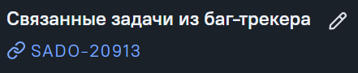

## Статический анализ тест-кейсов и экспорт структуры дерева требований из xMind в Allure
# Как запустить проект?
- npm i --legacy-peer-deps в корне репозитория
- npm i --legacy-peer-deps в проекте client
- в файле server/config.json в поле "url" установить "http://localhost:5000"
- в файле client/config.json в поле serverUrl установить "http://localhost:5000/api",
- в корне выполнить скрипт "npm run run" для запуска сервера
- в client запустить скрипт "npm start" для запуска клиента

Веб сервис запустится на http://localhost:3000/
Логи сервера смотреть в терминале IDE

# Предварительные условия для выполнения анализа:
- Тест-кейсы должны быть привязаны к задаче "Тестовая документация" через связанные задачи из баг-трекера

# Что сейчас проверяет статический анализ
- Статус должен быть Review 
- Должен иметь значение в кастомных полях "Priority" и "Version"
- Должен быть заполнен хотя бы один Тег на окружение (M D A S PWA)
- Шаги должны начинаться с глагола в неопределённой форме
- Тест-кейс должен иметь хотя бы один шаг
- Тест-кейс должен иметь значение в конечном ожидаемом результате
- Тест-кейс должен иметь заполненный слой (E2E Tests, Integration frontend Tests или Integration backend Tests)

# Как предлагать новые правила для статического анализа?
Завести идею Head of QA

# Что будет внедрено в будущем?
- Рекомендации по тест-кейсу с помощью AI (логика уже внедрена, осталось найти подходящий AI)